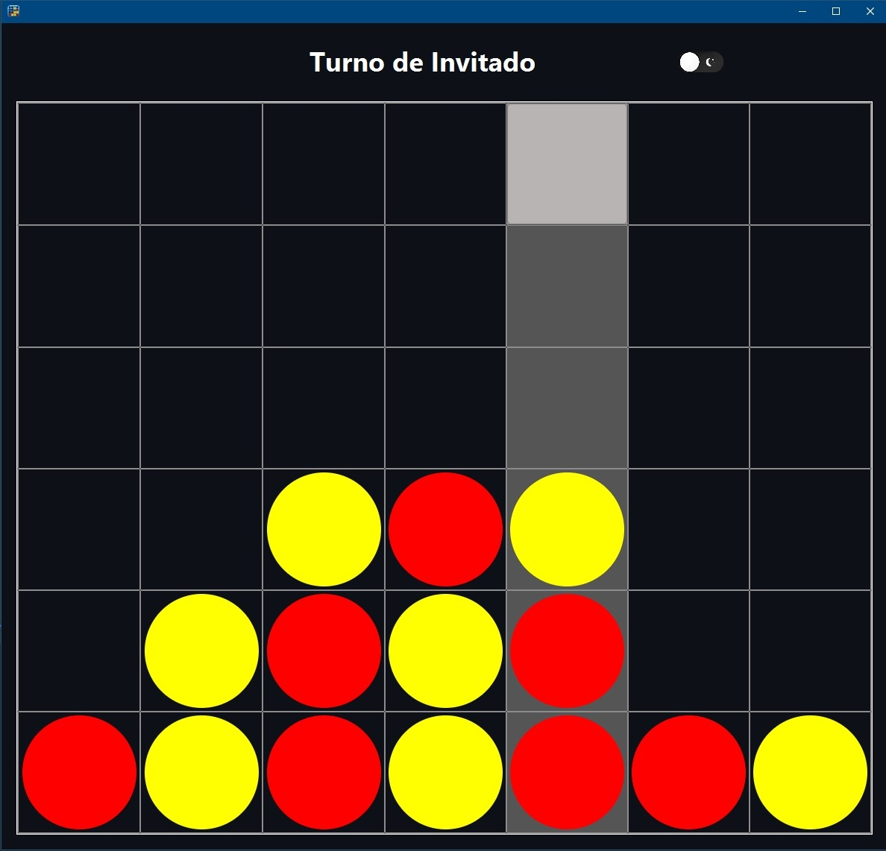
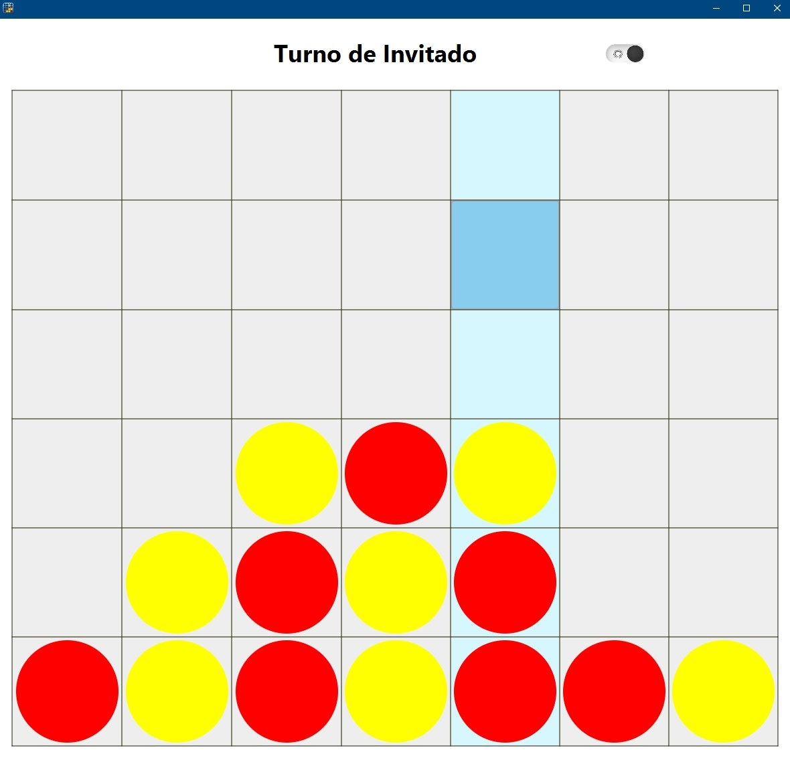

<table style="width: 100%; border-collapse: collapse; border: none;">
  <tr>
    <td align="left" style="vertical-align: middle; border: none;">
      <h1>4 en Raya - JavaFX</h1>
    </td>
    <td align="right" style="vertical-align: middle; border: none;">
      
    </td>
  </tr>
</table>

Este proyecto es una implementación del clásico juego **4 en Raya** o **Conecta 4** desarrollado en **Java** utilizando **JavaFX** y **SceneBuilder** para la interfaz gráfica.

## Descripción

El juego permite a un jugador enfrentarse a una máquina en una serie de partidas para determinar el ganador. Cada jugador (rojo y amarillo) coloca fichas en un tablero de 7 columnas por 6 filas, tratando de conectar cuatro fichas del mismo color en línea (horizontal, vertical o diagonal) antes que el oponente.

## Captura de pantalla

<div style="display: flex; justify-content: space-around; align-items: center;">
  
  
</div>

## Instalación y ejecución

1. Clona el repositorio en tu máquina local:
   ```bash
   git clone https://github.com/TheAlexey7123/4-en-Raya.git
   ```
2. Importa el proyecto en tu IDE (por ejemplo, NetBeans o IntelliJ IDEA).
3. Ejecuta la clase principal del proyecto para iniciar el juego.

## Integrantes del grupo

- **Alexey Omelchuk Yashchuk**
- **Eduard Calvo Pineda**
- **Marc Ramaker Sendra**

Grupo: **INF-ADE**
